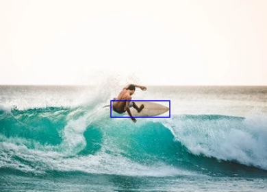
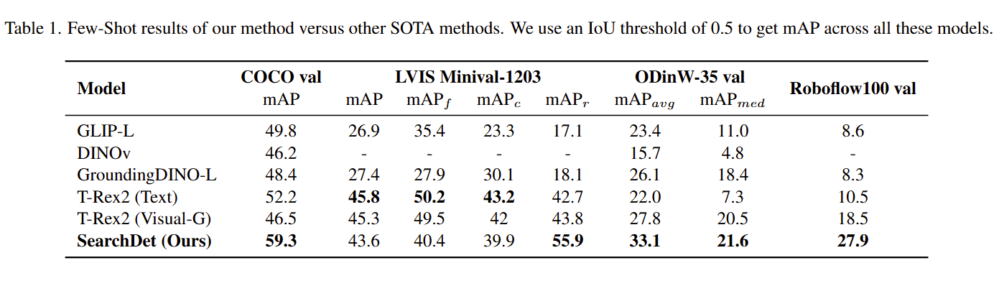
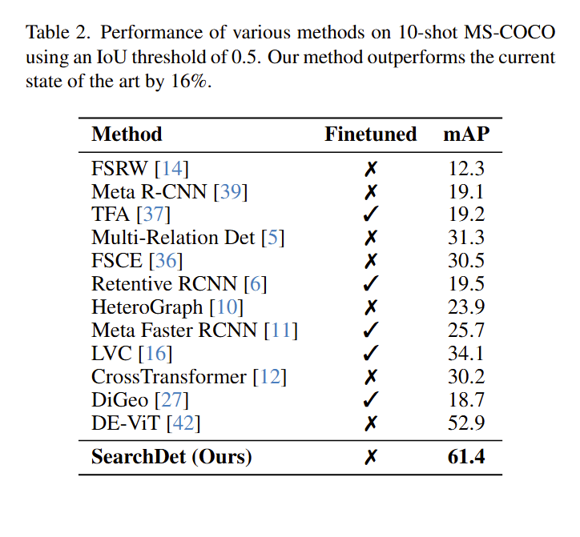

# 🔥 SearchDet: Training-Free Long Tail Object Detection via Web-Image Retrieval 🔥
By [Mankeerat Sidhu](https://mankeerat.github.io/), [Hetarth Chopra](https://www.linkedin.com/in/hetarth-chopra/), Ansel Blume, [Jeonghwan Kim](https://wjdghks950.github.io/), [Revanth Gangi Reddy](https://gangiswag.github.io/) and [Heng Ji](https://blender.cs.illinois.edu/hengji.html)

This repository contains the official code for SearchDet, a training-free framework for long-tail, open-vocabulary object detection. SearchDet leverages web-retrieved positive and negative support images to dynamically generate query embeddings for precise object localization—all without additional training.

---

<figure>
  
  <figcaption>The Architecture Diagram of our process. We compare the adjusted embeddings, produced by the DINOv2 model, of the positive and negative support images, with the relevant masks extracted using the SAM model to provide an initial estimate of our segmentation BBox. We again use DINOv2 for generating pixel-precise heatmaps which provide another estimate for the segmentation. We combine both these estimates using a binarized overlap to get the final segmentation mask. </figcaption>
</figure>

## SearchDet is designed to:

- ✅ Enhance Open-Vocabulary Detection: Improve detection performance on long-tail classes by retrieving and leveraging web images.
- ✅ Operate Training-Free: Eliminate the need for costly fine-tuning and continual pre-training by computing query embeddings at inference time.
- ✅ Utilize State-of-the-Art Models: Integrate off-the-shelf models like DINOv2 for robust image embeddings and SAM for generating region proposals.

Our method demonstrates substantial mAP improvements over existing approaches on challenging datasets—all while keeping the inference pipeline lightweight and training-free.

---

## Key Features
- Web-Based Exemplars: Retrieve positive and negative support images from the web to create dynamic, context-sensitive query embeddings.
- Attention-Based Query Generation: Enhance detection by weighting support images based on cosine similarity with the input query.
- Robust Region Proposals: Use SAM to generate high-quality segmentation proposals that are refined via similarity heatmaps.
- Adaptive Thresholding: Apply frequency-based thresholding to automatically select the most relevant region proposals.
- Scalable Inference: Achieve strong performance with just a few support images—ideal for long-tailed object detection scenarios.

---
## Reason to use Positive and Negative Exemplars

  
  

**Figure 3.** Illustration of our method providing more precise masks after including the negative support image samples. The negative query (e.g., “waves”) helps avoid irrelevant areas and focus on the intended concept (e.g., “surfboard”).

---
## Results - 

  
  

